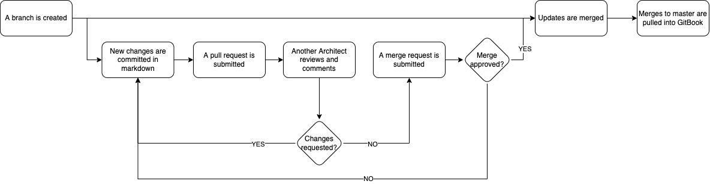

# Architecture Documentation Demo

## Table of Contents
*   [Instructions](/Instructions/README.md)
*   [Solution Architecture](/Solution_Architecture/README.md)
*   [Enterprise Architecture and Innovation](/Enterprise_Architecture/README.md)
*   [Technical Architecture](/Technical_Architecture/README.md)
*   [Overview](/ArchitectureDocsOverview/README.md)
 

## Purpose
This site is an integration test to determine the feasibility of treating architecture documentation as code, leveraging Markdown, Git, and GitBook. This test uses GitHub, but could just as easily use GitLab. The publishing flow works like this.

To view the test file, demonstrating the syntax of Markdown, click [here](/1.%20Instructions/MarkdownSyntax.md)
